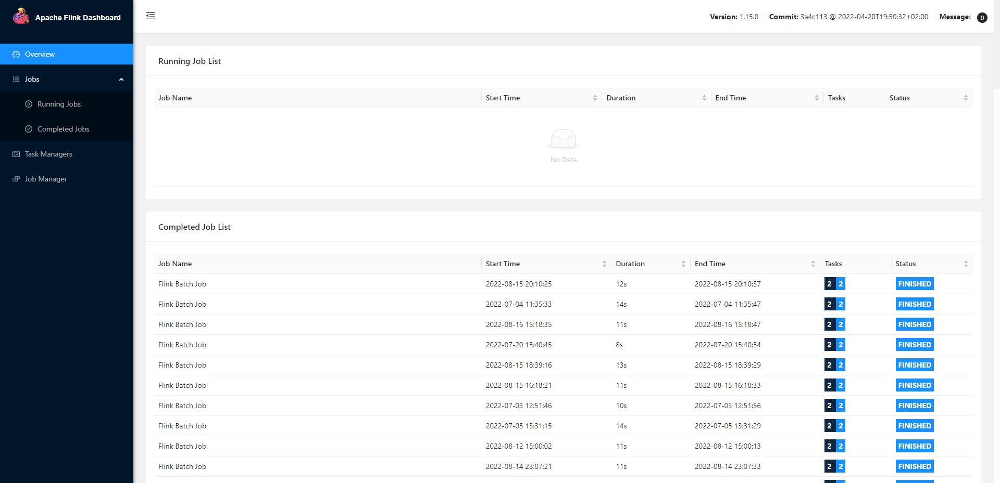

# Flink History Server

Flink has a history server that can be used to query the statistics of completed jobs (normally batch job) after the corresponding Flink cluster has been shut down.

Furthermore, it exposes a REST API that accepts HTTP requests and responds with JSON data.

The HistoryServer allows you to query the status and statistics of completed jobs that have been archived by a JobManager.

After you have configured the HistoryServer and JobManager, you start and stop the HistoryServer via its corresponding startup script:

```
# Start or stop the HistoryServer
./bin/historyserver.sh (start|start-foreground|stop)
```

By default, this server binds to localhost and listens at port **8082**.

Currently, you can only run it as a standalone process.



## Configuration

you could use Hadoop Azure Support: ABFS — Azure Data Lake Storage Gen2 URI format for accessing Azure Data Lake Storage Gen2.

```
fs.azure.account.key.<your-azure-account>.dfs.core.windows.net: <your-azure-account-key>
```

you could refer to [Hadoop Azure Support: ABFS — Azure Data Lake Storage Gen2](https://hadoop.apache.org/docs/stable/hadoop-azure/abfs.html)

### JobManager

The archiving of completed jobs happens on the JobManager, which uploads the archived job information to a file system directory. You can configure the directory to archive completed jobs in flink-conf.yaml by setting a directory via jobmanager.archive.fs.dir.

```
# Directory to upload completed job information
jobmanager.archive.fs.dir: "abfss://<your-container>@<your-azure-account>.dfs.core.windows.net/completed-jobs/"
```

### HistoryServer

The HistoryServer can be configured to monitor a comma-separated list of directories in via historyserver.archive.fs.dir.

```
# Monitor the following directories for completed jobs
historyserver.archive.fs.dir: "abfss://<your-container>@<your-azure-account>.dfs.core.windows.net/completed-jobs/"

# Refresh every 10 seconds
historyserver.archive.fs.refresh-interval: 10000
```
