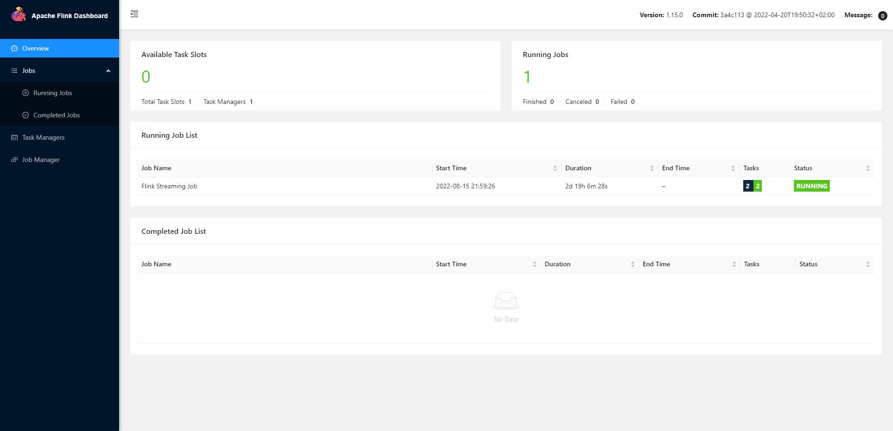

# Flink on Native Azure Kubernetes

Kubernetes is a popular container-orchestration system for automating computer application deployment, scaling, and management. Flink’s native Kubernetes integration allows you to directly deploy Flink on a running Kubernetes cluster. Moreover, Flink is able to dynamically allocate and de-allocate TaskManagers depending on the required resources because it can directly talk to Kubernetes.

This tutorial will show how to deploy Apache Flink natively on Azure Kubernetes.

## Prerequisites

Basic:

* [Git](https://www.git-scm.com/downloads)
* [Java Development Kit (JDK) 1.8](https://www.oracle.com/java/technologies/javase/javase8u211-later-archive-downloads.html)
* [Apache Maven](http://maven.apache.org/download.cgi) and [install](http://maven.apache.org/install.html) a Maven binary archive
* [Azure CLI](https://docs.microsoft.com/en-us/cli/azure/install-azure-cli)

Azure:

* [Azure Container Registry](https://azure.microsoft.com/en-us/services/container-registry/)
* [Azure Kubernetes](https://azure.microsoft.com/en-us/services/kubernetes-service/)

Flink:

* [Flink](https://downloads.apache.org/flink)

## Build Flink Job

Build your flink job with Maven

```
mvn clean package
```


## Create and Publish the Docker image to Azure Container Registry

The Flink community provides a base Docker image which can be used to bundle the user code:

```
ARG java_version=java8
ARG scala_version=scala_2.12
ARG flink_version=1.15.0
FROM flink:$flink_version-$scala_version-$java_version

ARG artifact_id=flink-example
ARG version=1.0-SNAPSHOT

RUN mkdir -p $FLINK_HOME/usrlib
COPY target/$artifact_id-$version.jar $FLINK_HOME/usrlib/$artifact_id-$version.jar
```

And you can build image and publish it into Azure Container Registry

```
az acr login --name $(registry)

docker build --no-cache -t $(registry).azurecr.io/$(artifact_id):$(version) .
docker push $(registry).azurecr.io/$(artifact_id):$(version)
```

## Deploy Flink Job on Azure Kubernetes (Application mode)

get kubeconfig use Azure CLI:

```
az aks get-credentials --resource-group $RESOURCE_GROUP --name $CLUSTER
```

create role & rolebinding to your default service account

```

kubectl create role flink-role --verb=get --verb=list --verb=watch --verb=create --verb=update --verb=patch --verb=delete  --resource=pods,services,deployments,namespaces --namespace=$(namespace)

kubectl create rolebinding flink-rolebinding --role=flink-role --serviceaccount=$(namespace):default --namespace=$(namespace)

```

create secret for accessing Azure Container Registry:

```
kubectl create secret docker-registry $(registry)-secret \
    --docker-server=$(registry).azurecr.io \
    --docker-username=$(registry_password) \
    --docker-password=$(registry_password) \
    --namespace=$(namespace)
```

deploy Flink job with native k8s application mode through Flink CLI:

```
tar -zxvf flink-1.15.0-bin-scala_2.12.tgz
cd flink-1.15.0/
/bin/flink run-application \
  --target kubernetes-application \
  -Dkubernetes.namespace=$(namespace) \
  -Dkubernetes.cluster-id=$(artifact_id) \
  -Dkubernetes.container.image=$(registry).azurecr.io/$(artifact_id) \
  -Dkubernetes.container.image.pull-secrets=$(registry)-secret \
  -Dkubernetes.container.image.pull-policy=Always \
  local:///opt/flink/usrlib/$artifact_id-$version.jar
```

You could access Flink Web UI through

```
kubectl port-forward svc/$artifact_id-rest 8081 -n flink
```

and access http://localhost:8081


